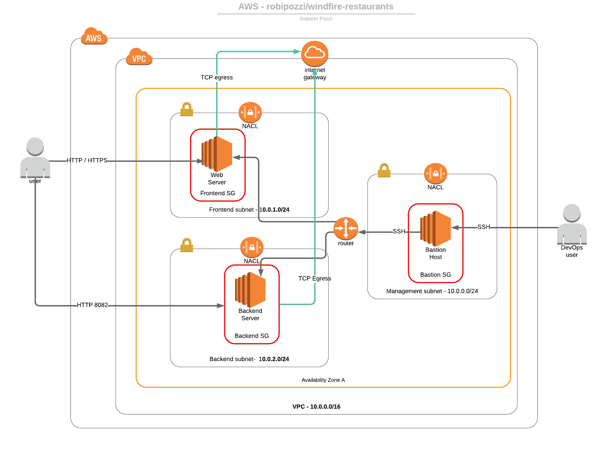
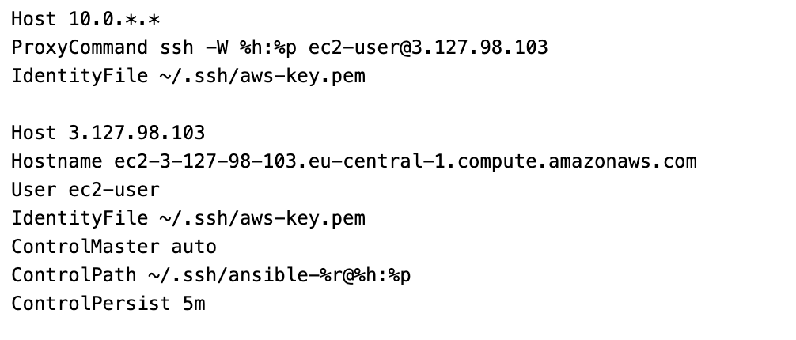

# Windfire Restaurants Backend (Node.js version)
This repository holds the code for the backend microservice of my *Windfire Restaurants* management application, along with scripts, playbooks and configurations to automate application run and deployment to target infrastructures.

It is a simple microservice, running on Node.js, that serves a basic Hello World html page and exposes 2 REST endpoints:
* */healthz* endpoint - it returns a string, testing that the application is up and healthy
* */restaurants* endpoint - it returns a list of restaurants in Json format

## Before you start
Before starting to use and test this microservice you need to ensure all the prerequisite software is installed:
* *Node.js* - installation instructions are available for different platforms at *https://nodejs.org/en/download/*. The application has been developed and tested with Node.js v8.11.3.
* *npm* - Node.js Package Manager is distributed with Node.js, which means that when you download Node.js, you automatically get npm installed on your computer. The application has been developed and tested with npm v5.6.0.

## Run microservice on local
This microservice can be run by simply launching **app-run.sh** script, available in the */app* repository sub-folder.

## DevOps automation
Automation is implemented using Ansible technology (https://www.ansible.com/): refer to Ansible technical documentation (https://docs.ansible.com/) for detailed instructions regarding installation and setup.

The **deploy.sh** and **undeploy.sh** scripts are provided to run deployment/undeployment automation tasks, as it can be seen in the figure below. 

The scripts currently expose 4 deployment/undeployment options:
* *Raspberry* : it automates *Windfire Restaurants Backend* microservice deployment/undeployment in a Raspberry Pi target architecture;
* *AWS Single Zone* : it automates *Windfire Restaurants Backend* microservice deployment to an AWS architecture with publicly accessible Frontend and Backend subnets in a single availability zone
* *AWS Multi Zone* : it automates *Windfire Restaurants Backend* microservice deployment to an AWS architecture with Frontend and Backend subnets in a variable number of availability zones to create a Fault Tolerant architecture
* *OpenShift* : it automates *Windfire Restaurants Backend* microservice deployment to an OpenShift cluster

### Raspberry deployment architecture
A file, named **ansible.cfg**, is provided to set basic configurations needed to run Ansible: the **deploy.sh** and **undeploy.sh** scripts set ANSIBLE_CONFIG environment variable pointing to this file; the basic configuration you should have is something like this:

where:

* *inventory* defines where Ansible will look for the inventory file, which is used by Ansible to know which servers to connect and manage;
* *private_key_file* points to the SSH private key used by Ansible to connect and launch tasks on the target infrastructure.

Change the parameters according to your environment.

The scripts wrap Ansible to automate deployment tasks, using the Ansible provided playbook [deployment/raspberry/deploy.yaml](deployment/raspberry/deploy.yaml) for deployment and the Ansible provided playbook [deployment/raspberry/remove.yaml](deployment/raspberry/remove.yaml) for microservice undeployment.

### AWS architecture
AWS target deployment environment is based on the following Architecture

*Windfire Restaurant Backend* microservice is deployed to an EC2 instance placed in the Backend subnet. 

For security reasons, either the Frontend and Backend subnets are not directly accessible via SSH. Ansible automation script is configured to connect to the target hosts via a Bastion Host, conveniently placed in the Management subnet.

In case of deployment to AWS, since the Cloud architecture is more dynamic by nature, the **deploy.sh** and **undeploy.sh** scripts delegate to [deployment/aws/ansible-config.sh](deployment/aws/ansible-config.sh) script the dynamic definition of 2 files that are used by Ansible:

* *ansible-aws.cfg*, which dynamically sets Ansible configuration. An example of such a configuration is reported in the following figure

* *ansible-ssh.cfg*, which sets SSH configurations to allow Ansible to connect to Frontend and Backend instances, through the Bastion Host. An example of such a configuration is reported in the following figure

The scripts wrap Ansible to automate deployment tasks, using the Ansible provided playbook [deployment/aws/deploy.yaml](deployment/aws/deploy.yaml) for deployment and the Ansible provided playbook [deployment/aws/remove.yaml](deployment/aws/remove.yaml) for microservice undeployment.

### OpenShift architecture
In case of deployment to OpenShift **deploy.sh** delegates to [deployment/openshift/deploy.sh](deployment/openshift/deploy.sh) script, which in turn [TODO]